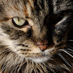

cat
===

This project is to demonstrate the **Arnold Cat** map.

Just type *python cat.py* and then look through generate images (cat_000.png ... cat_150.png).

The code is slightly modified from [this](http://www.janeriksolem.net/2012/06/arnolds-cat-map.html)

Use *convert* to make an animated GIF file:

    convert -delay 20 -loop 0 cat_???.png  cat.gif

Requirements
------------
```bash
pip install Image numpy
```

Or install PIL or Pillow instead of Image... (Image should install Pillow).

Demo animate (use 121 frames)
----------------------------



Reference
---------
* [Python code from solem's vision blog](http://www.janeriksolem.net/2012/06/arnolds-cat-map.html)
* [Online Arnold's Cat Map](http://www.jasondavies.com/catmap/)
* [Recurrence] (http://www.mpipks-dresden.mpg.de/mpi-doc/kantzgruppe/wiki/projects/Recurrence.html#References)
* [Wikipedia Arnold's cat map] (http://en.wikipedia.org/wiki/Arnold%27s_cat_map#cite_note-Arnold-1)

